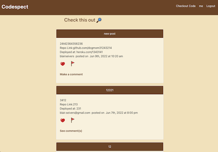
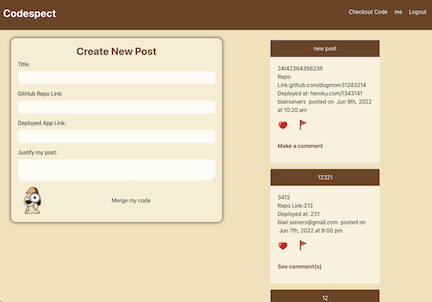

# 
**Coffee & Parenting** 

### 
A social network app where parents can connect with each other to ask for advice,share their concerns or talk about their children!
  
 Coffee&Parenting's goal is to be a network of support and connection, making parenting just a little easier.
  
 

## Licensing

## 
**TABLE OF CONTENTS**

***
1. **[Technologies](#technologies)**
2. **[Challenges & Successes](#challengessuccesses)**
3. **[Deployment](#deployment)**

### Technologies:
* React
* GraphQl
* Apollo Server
* Apollo Client
* Node.js
* MongoDB
* JSON Web Tokens
* React Bootstrap

## 
**CHALLENGES & SUCCESSES**

***
### Challenges:
* Consistancy in the names of endpoints for the front and back end.
* React state managenment.
* Using GraphQL for the first time.

### Successes:
* Taking all errors as learning opportunities.
* Using refetch query to help manage react state.

## 
**DEPLOYMENT**

***
### 
You can find our app deployed **[here on Heroku](https://salty-shelf-69418.herokuapp.com)**

## 
**USAGE**

***
### 
_When you open up the app, you will be invited to connect with other parents for a virtual coffee.

### 
_Here is the main page referred to as 'Checkout Code', where you can see a list of all users posts. Once logged in, you will be able to leave comments to help out other developers, like posts with really impressive code, or flag posts that maybe have some errors in their files to correct._

### 
_Lastly, we have the user page, where you can create new posts and view all of your own existing posts._

 

### 
Created by Geiciane Barham ©2022

